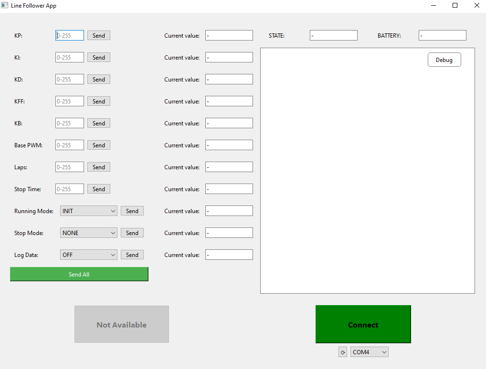
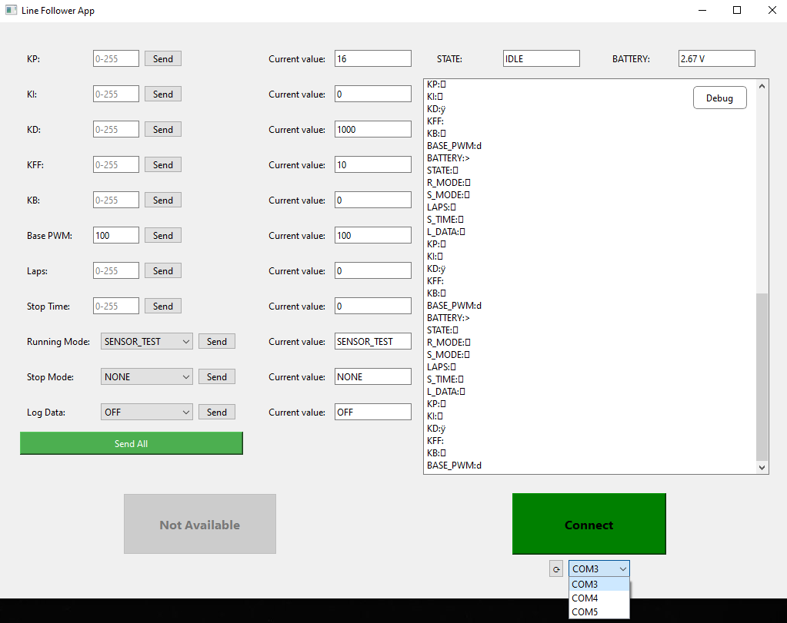
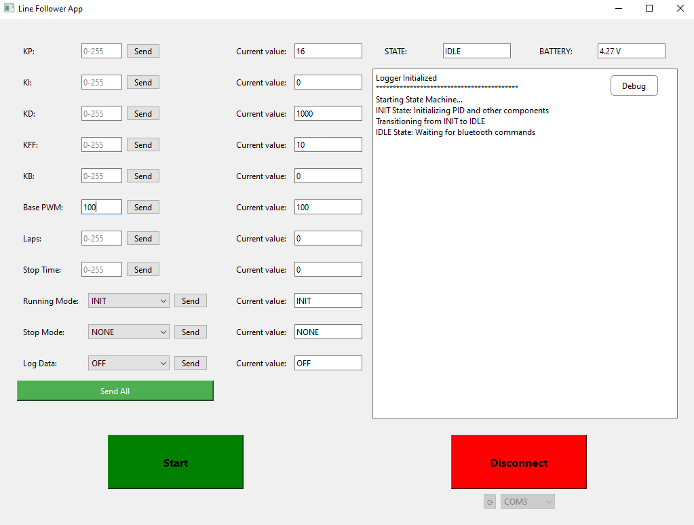
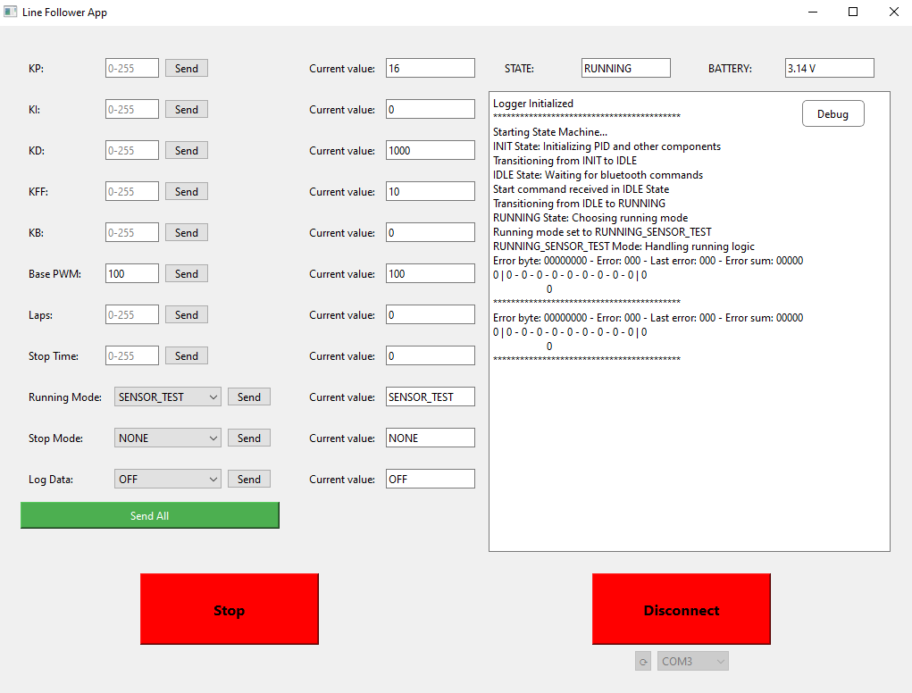
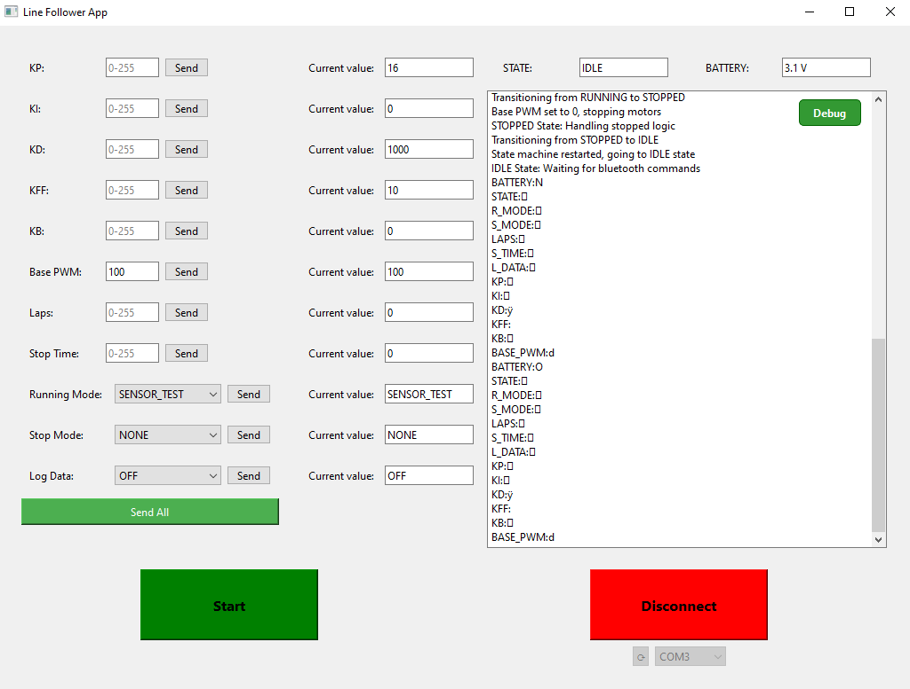
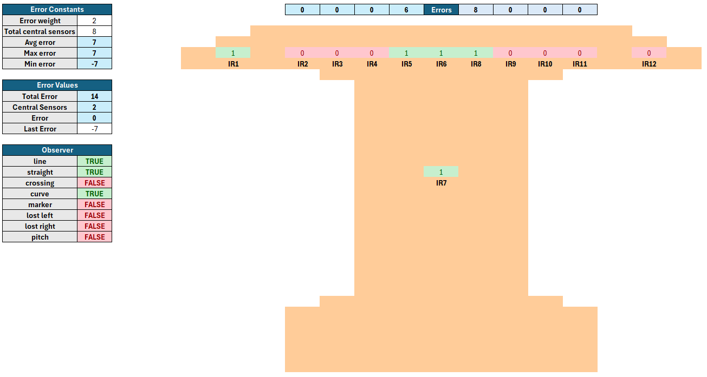
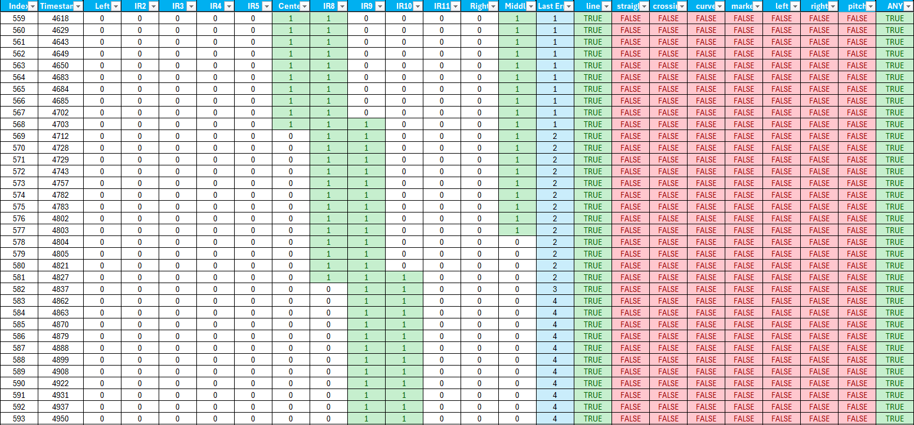

# Line Follower Desktop App

This is a desktop application written in Python using `PyQt6` for the user interface. The app is designed to communicate with the Line Follower Robot via serial communication, allowing for remote control, monitoring, and debugging of the robot's state and performance.

<div align="center">
  
</div>

## Contents

- [Features](#features)
- [Requirements](#requirements)
- [Project Structure](#project-structure)
- [Usage](#usage)
- [How It Works](#how-it-works)
  - [Serial Communication](#serial-communication)
  - [Port Selector](#port-selector)
  - [Sender Widget](#sender-widget)
  - [Listener](#listener)
  - [LineFollower Object](#linefollower-object)
  - [Logging](#logging)
- [Workflow](#workflow)

## Features

- **Serial Communication**: Sends commands to and receives data from the robot using a serial connection.
- **Real-Time Monitoring**: Displays the robot's current state, sensor data, and other runtime information.
- **Command Sender**: Provides an interface to send predefined commands to the robot, such as starting, stopping, or adjusting parameters.
- **Threaded Listener**: Listens to incoming serial messages in a separate thread to ensure smooth UI operation.
- **Robot State Representation**: Uses a [`LineFollower`](robot/line_follower.py) object as a singleton to represent the robot's current state throughout the application.

## Requirements

The application can be run directly as a Python script or compiled into an executable using tools like `PyInstaller`. The following dependencies are required:

- Python 3.9 or higher
- `PyQt6`
- `pyserial`

All dependencies can be installed from the [`requirements.txt`](requirements.txt) file using pip:

```bash
pip install -r requirements.txt
```

## Project Structure

```plaintext
line_follower_app_dsk/
├── data/                  # Data files for logging robot operations
├── docs/                  # Documentation files
├── gui/                   # Graphical User Interface components
│   ├── ui                 # UI elements, such as widgets, layouts and the main window
│   ├── workers            # Background workers for handling long-running tasks
│   ├── main.py            # Entry point for the GUI application
├── robot/                 # Robot-related components
│   ├── line_follower.py   # Singleton object representing the robot
│   └── ...                # Other robot-related files
├── scripts/               # Auxiliary scripts for testing or setup
├── utils/                 # Utility functions
├── main.py                # Entry point of the application
├── pyproject.toml         # Project metadata and python configurations
└── requirements.txt       # Python dependencies
```

## Usage

1. Clone the repository:

   ```bash
   git clone https://github.com/l1h2/line_follower_app_dsk.git
   cd line_follower_app_dsk
   ```

2. Run the application:

   ```bash
   python main.py
   ```

   or compile it into an executable using `PyInstaller`:

   ```bash
   pyinstaller --onefile main.py
   ```

## How It Works



### Serial Communication

The app uses the `pyserial` library to establish a serial connection with the robot using a [`connection API`](robot/api/main.py). It supports both sending and receiving data, with error handling for connection issues. Its main purpose is to connect to the robot's `HC-05` bluetooth module, but it can also be used with a `USB` connection.

### Port Selector

The [connector widget](gui/ui/widgets/home/connector/connector.py) allows the user to select the serial port to which the robot is connected. It automatically detects available ports and provides a dropdown menu for easy selection.



This can be used to switch between different connection modes such as `USB` or `Bluetooth`. The app also provides a button to refresh the list of available ports in case the robot is connected or disconnected.

### Sender Widget

The [sender widget](gui/ui/widgets/home/sender) provides an interface for sending commands to the robot. It includes predefined commands for starting, stopping, and adjusting parameters, as well as a custom command input for advanced users.



All messages used in the communication protocol can be found in [messages.py](utils/messages.py) and are composed of two bytes:

- **Command Byte**: The first byte indicates the command type (e.g., start, stop, set `PWM`).
- **Data Byte**: The second byte contains the data associated with the command.

All commands use a single byte for the data value, which is sufficient for most operations. However for the `SET_KD` command, there is a special case when sending `255` (0xFF) as the data byte. In this case, the command is interpreted by the robot as a request to saturate the `KD` term, and so it is replaced by `1000` instead. This allows for the use of a more extensive command list without changing the standard message size for the protocol.

### Listener

The [listener](gui/ui/widgets/home/listener/) runs a [worker](gui/workers/listener.py) in a separate thread to handle incoming serial messages without blocking the UI. It processes the received messages and updates the `LineFollower` object accordingly. It also manages the main text display, where all incoming messages are shown.



The `Debug` button can be pressed to toggle printing of protocol messages to the console, allowing for a less cluttered view of the main text display.



The `listener worker` can also listen for binary messages when `LOG_DATA` is enabled for the robot. This allows for real-time drawing of the track to the main display by using the received sensor data.

### LineFollower Object

The [`LineFollower`](robot/line_follower.py) object is a singleton that represents the robot's current state. It stores all information used by the robot abd is updated every time a new command message is received by the `listener`. This allows for easy access to the robot's state throughout the application. For more information on the line follower robot, please refer to the [robot's repository](https://github.com/l1h2/line_follower).

### Logging

The app can log all incoming messages to a file in the [`data`](data) folder. This is useful for debugging and analyzing the robot's performance over time and can be used alongside the [observer spreadsheet](docs/Sensors%20Observer.xlsx) to help understand the robot's behavior during operations.

This can be done individually by using the interactive functionality of the spreadsheet to simulate different operation conditions:



Or by using the `LOG_DATA` command to log all sensor data in real-time. This will create a new file in the [`data`](data) folder with all captured information in binary format. This file can then be processed with the [read_binary.py](scripts/read_binary.py) script to extract the data to a `CSV` file. This can be done by running the following command:

```bash
python scripts/read_binary.py
```

The resulting `CSV` can then be added to the spreadsheet for further analysis, mapping the entire track as seen by the robot during operations:



## Workflow

1. Select the serial port and connect to the robot.
2. The listener receives and processes messages from the robot, updating the `LineFollower` object.
3. Set the configuration parameters for the robot operation.
4. Start the robot in the `RUNNING_MODE` selected.
5. The UI displays the robot's state and performance in real-time.
6. Adjust parameters during operation to calibrate and test the robot's performance.
7. Optionally stop the robot to restart the operation with new parameters.
